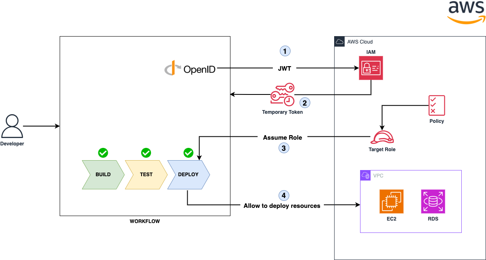
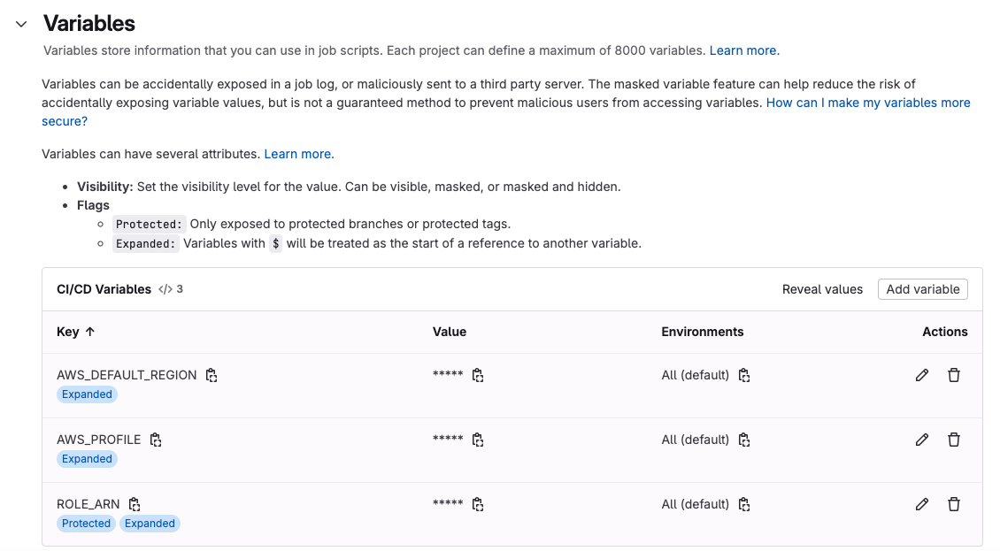

# 🚀 Set up OIDC in AWS for GitLab CI/CD with Terraform

This project configures an **OIDC Identity Provider** in AWS to allow **GitLab CI/CD** to assume IAM roles using OIDC tokens. This removes the need for **Access Keys** in pipelines, improving security and simplifying credential management.

---

## 📋 Requirements

- **Terraform CLI** installed.
- AWS account with IAM permissions.
- GitLab configured as an Identity Provider (IdP).
- Required variables:
  - `gitlab-url`: GitLab URL (e.g., `https://gitlab.com`).
  - `match-field`: Field for the condition (e.g., `sub`).
  - `match-value`: Value to match in the token (e.g., `"project_path:francotel/*:ref_type:branch:ref:main"`).

---



## 📂 Project Structure

```plaintext
.
├── main.tf               # Main Terraform code
├── variables.tf          # Variables declaration
├── outputs.tf            # Outputs
└── README.md             # Documentation
```

## GitLab CI Setup for AWS Assume Role with OIDC

### Set Variables in GitLab CI:
- `ROLE_ARN`: Set this in GitLab Project settings (CI) after running `terraform apply`.
- `AWS_DEFAULT_REGION`: Set the region where your AWS resources are located.
- `AWS_PROFILE`: Set this to "oidc" for AWS to use the OIDC configuration.

### Assume Role Function:
- This function gets temporary AWS credentials using STS in the `before_script`.
- It checks if the configured role has permissions.

### OIDC Token:
- `MY_OIDC_TOKEN` is an ID token that should have the audience (`aud`) value set to your service URL.



### GitLab CI Job Example:

```yaml
assume-role-oidc:
  image:
      name: amazon/aws-cli:2.2.18
      entrypoint: [""]
  id_tokens:
    MY_OIDC_TOKEN:
      aud: https://gitlab.com
  before_script:
    - mkdir -p ~/.aws
    - echo "${MY_OIDC_TOKEN}" > /tmp/web_identity_token
    - echo -e "[profile oidc]\nrole_arn=${ROLE_ARN}\nweb_identity_token_file=/tmp/web_identity_token" > ~/.aws/config
  script:
    - aws sts get-caller-identity
    - aws s3 ls
```